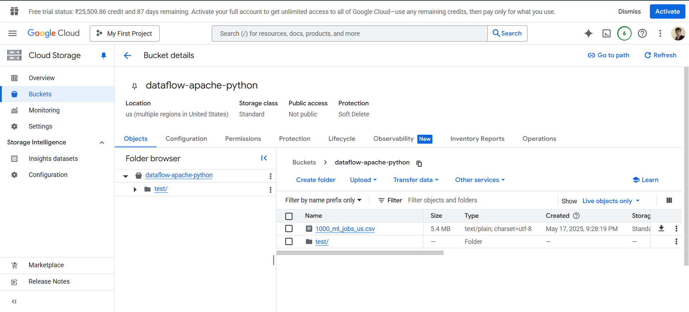
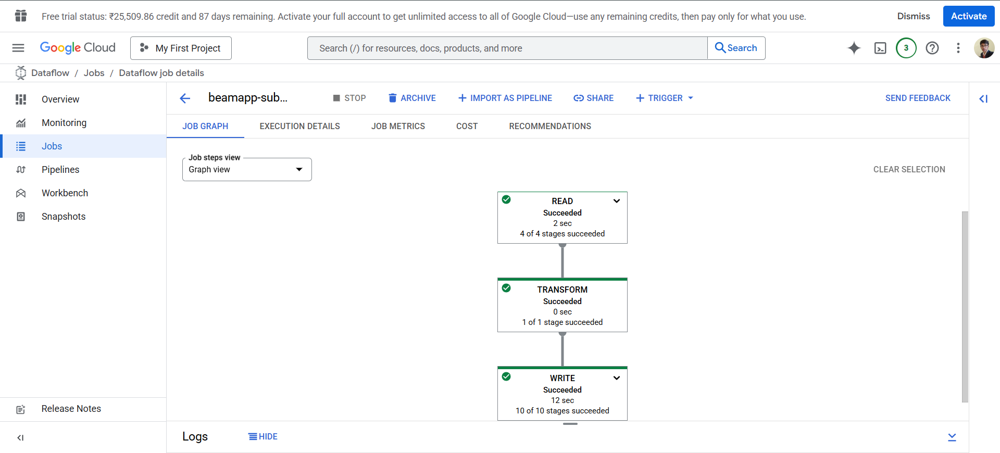
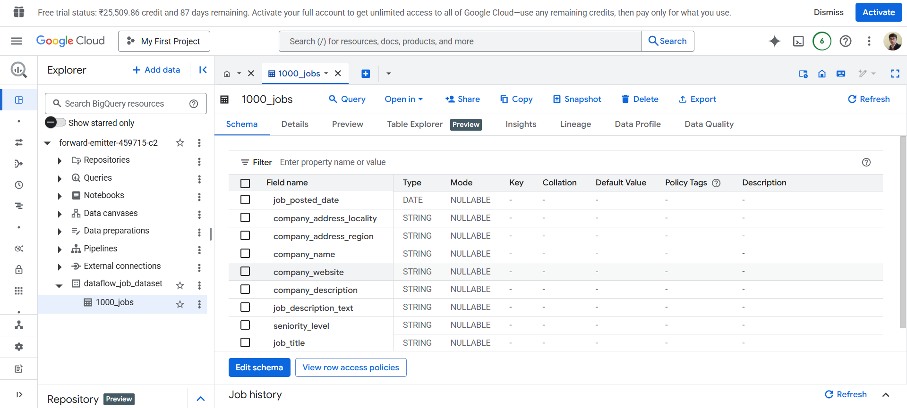
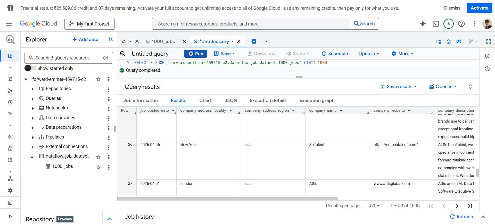

# A Data Engineering and DevOps Project

---

- Used GCP's Dataflow to E.T.L a dataset, obtained from Kaggel, to a Dataset table in BigQuery.
- Coded in python, using Apache Beam's SDK.
- Terraform scripts to automate infrastructure like GS Bucket, Bucket Object (CSV file), BigQuery Dataset & Dataset Table.
- Created a CMD file containing the command to run [insertion_into_bigquery.py](insertion_into_bigquery.py), making things alot easier during debugging phases.
- Used methods like ReadFromCSV to read the csv file while extracting phase and WriteToBigQuery to write data to a Big Query Dataset Table.

## Screenshots of the Execution

- GS Bucket

- Dataflow Job

- Dataset Table (after ETL process)

- Running Query on the Table

